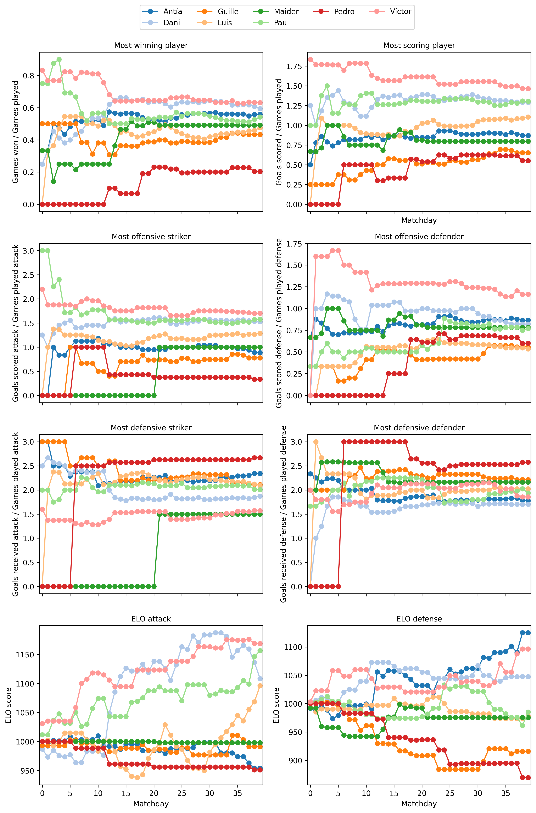

# ICE Champions League

## Resultats més recents
[WinPlayed dataframe](results/winplayed_stats.html)

Aquest Jupyter Notebook recull els resultats de la 1a temporada de la ICE Champions League. Al principi del codi es llegeixen les dades. Després, es calculen les estadísitques de cada participant d'acord amb els partits que ha jugat i els seus resultats. Seguidament, es mostren 4 classificacions d'exemple (Victòries/Partit, Gols/Partit, Gols d'equip / Partits atacant, Gols rebuts/Partits defensor). Es poden canviar els paràmetres per veure altres classificacions. Finalment, hi ha una versió preliminar d'un model de Deep Learning en el qual es predigui el resultat (Victòria o Derrota) per un partit donat.

He intentat posar els resultats agrupats a la mateixa zona del codi.

Canvieu el que cregueu oportú!

## Resultats de la 1a temporada
Victòries / Partit : Víctor

Gols / Partit: Pau

Millor parella: Víctor i Pedro

Pitjor parella: Simone i Pedro